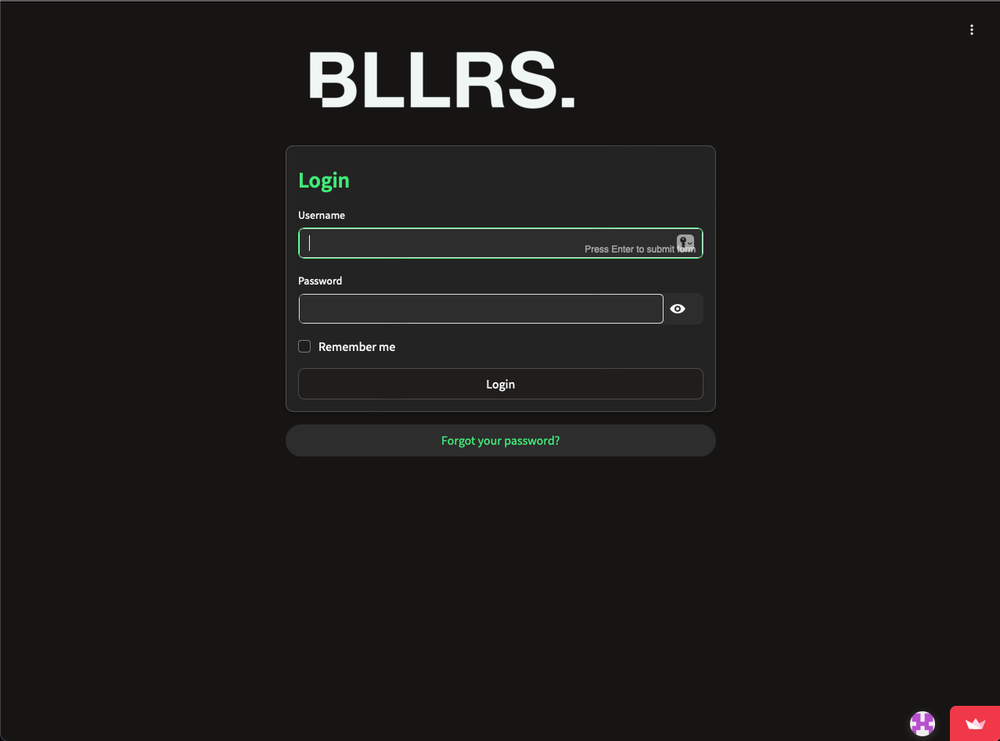
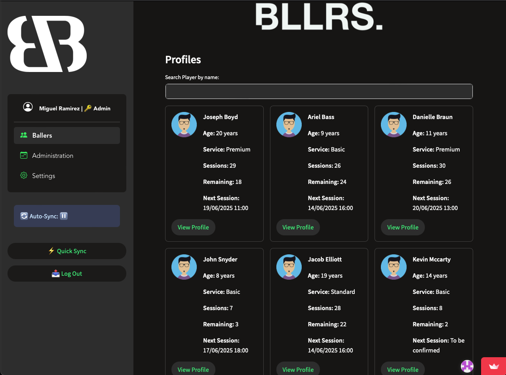
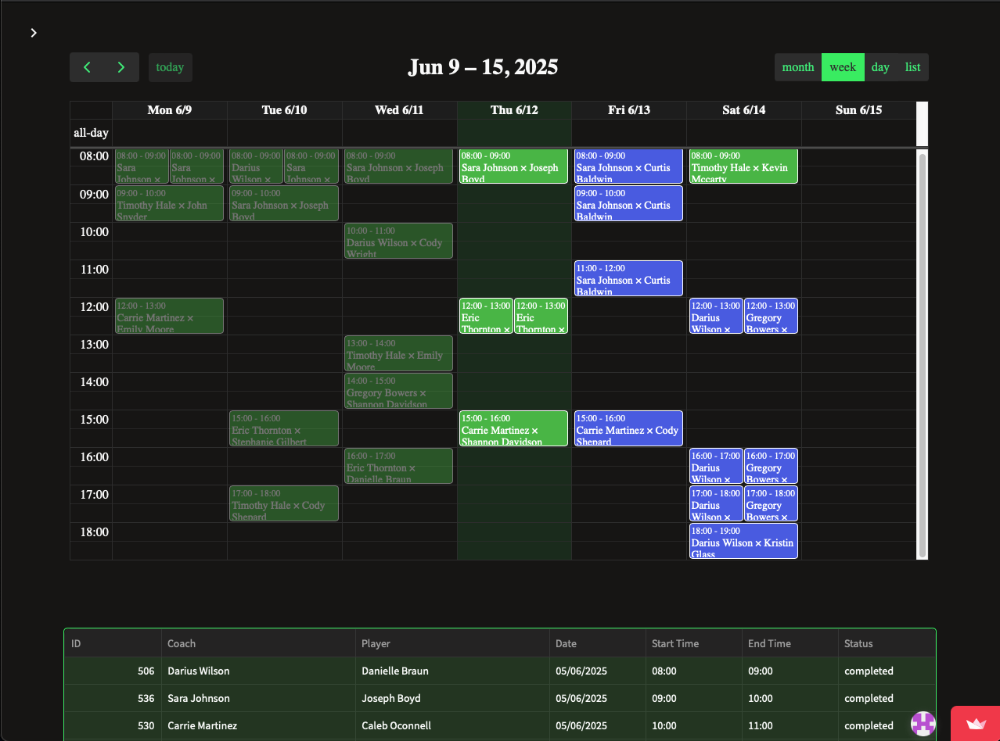
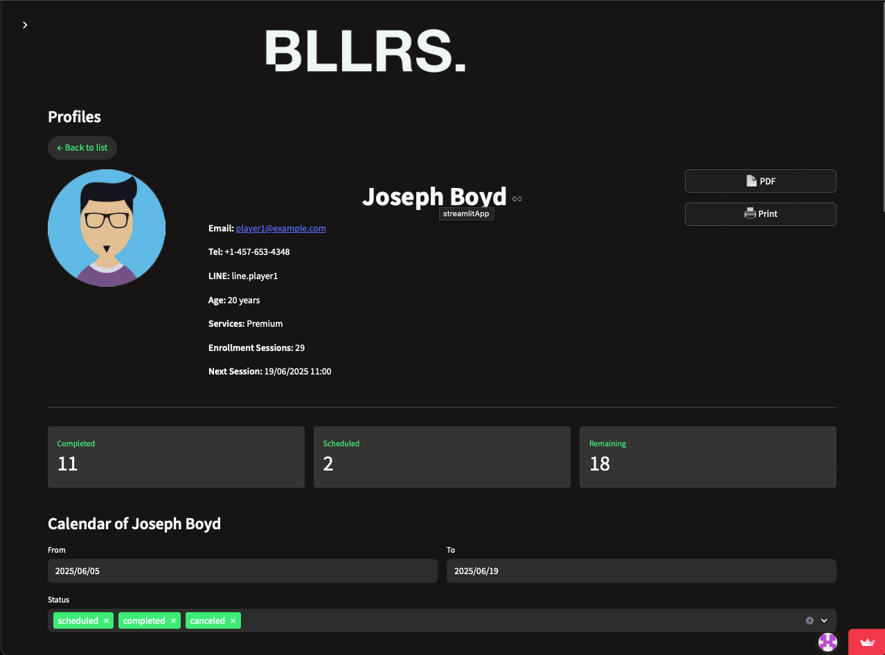
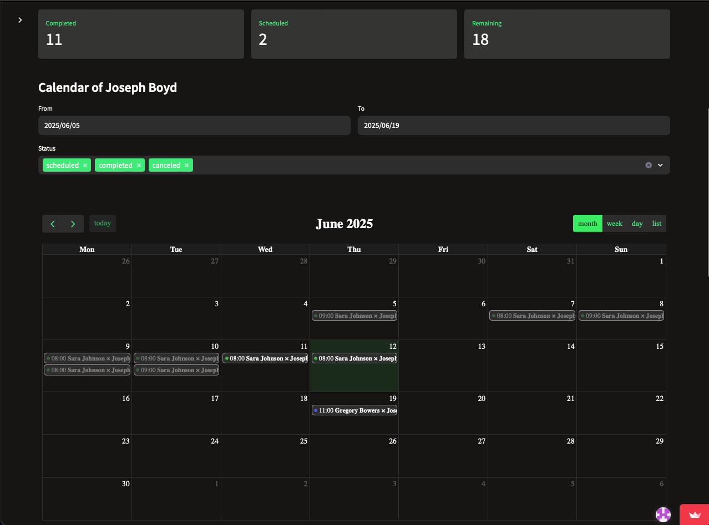
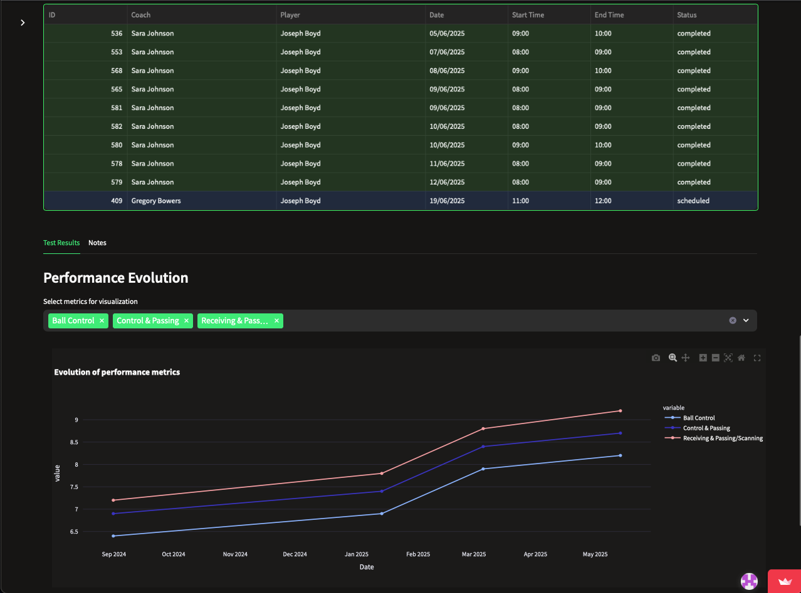
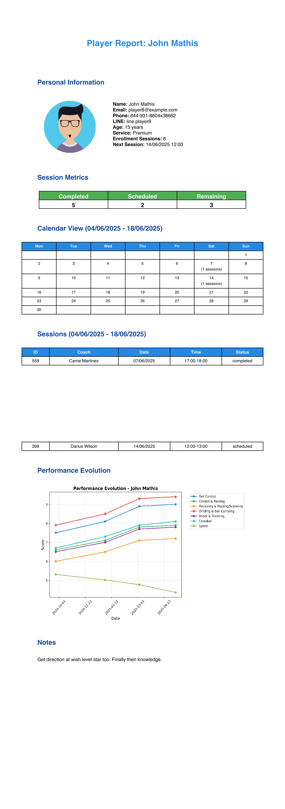
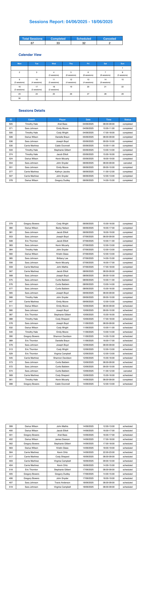
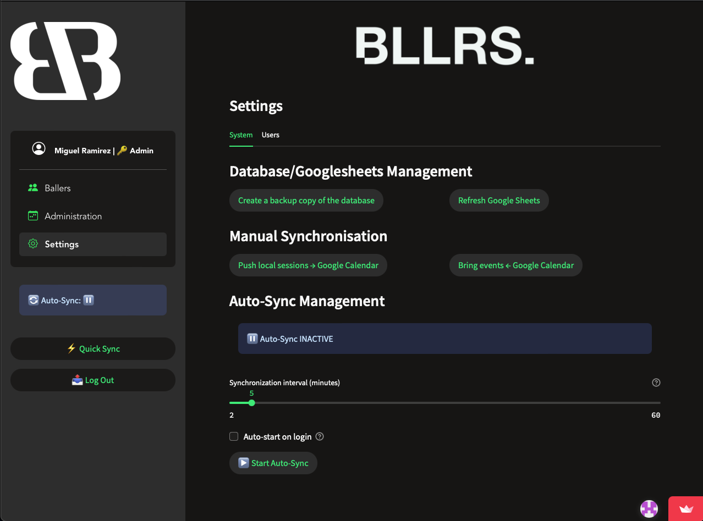

# ⚽ Ballers App

> **Una aplicación completa de gestión deportiva desarrollada con Dash para coaches, jugadores y administradores.**

Ballers App es una plataforma web moderna que integra gestión de sesiones de entrenamiento, calendario inteligente, análisis de rendimiento y reportes financieros, todo en una interfaz intuitiva y responsive.

## 🎯 **Características Principales**

### 👥 **Gestión de Usuarios**
- **3 tipos de usuario**: Administradores, Coaches y Jugadores
- **Autenticación segura** con sistema "Remember Me"
- **Perfiles personalizados** con fotos y datos específicos
- **Control de permisos** granular por tipo de usuario

### 📅 **Sistema de Sesiones**
- **Calendario interactivo** con vista mensual/semanal/diaria
- **Sincronización bidireccional** con Google Calendar
- **Estados de sesión**: Programadas, Completadas, Canceladas
- **Auto-actualización** de sesiones pasadas
- **Gestión de conflictos** inteligente

### 🔄 **Sincronización Automática**
- **Auto-sync** configurable con Google Calendar
- **Resolución de conflictos** automática
- **Notificaciones** de cambios y problemas
- **Logs detallados** de sincronización

### 📊 **Análisis y Reportes**
- **Dashboard financiero** integrado con Google Sheets
- **Métricas de rendimiento** de jugadores
- **Evolución temporal** de tests físicos
- **Exportación a PDF** de perfiles y sesiones
- **Gráficos interactivos** con Plotly

### 🖨️ **Exportación e Impresión**
- **Reportes PDF** profesionales de jugadores
- **Reportes de sesiones** por coach o administrador
- **Reportes financieros** con gráficos
- **Impresión optimizada** desde navegador

## 🚀 **Demo en Vivo**

🌐 **Aplicación Disponible en Producción**

*La aplicación está desplegada en Render con base de datos Supabase PostgreSQL.*

## 📸 **Screenshots**

<details>
<summary>Ver capturas de pantalla</summary>

### Login


### Dashboard Principal


### Calendario de Sesiones


### Perfil de Jugador


### Perfil de Jugador


### Perfil de Jugador


### Reporte Player PDF


### Reporte Sessions PDF


### Reporte Financials PDF


### Settings


</details>

## 🛠️ **Instalación**

### **Prerrequisitos**
- Python 3.9 o superior
- Cuenta de Google Cloud con APIs habilitadas
- Git

### **1. Clonar el repositorio**
```bash
git clone https://github.com/josangl08/Ballers_V2/tree/development
cd ballers-app
```

### **2. Crear entorno virtual**
```bash
python -m venv venv
source venv/bin/activate  # En Windows: venv\Scripts\activate
```

### **3. Instalar dependencias**
```bash
pip install -r requirements.txt
```

### **4. Configurar variables de entorno**
```bash
cp .env.example .env
# Editar .env con tus configuraciones
```

### **5. Configurar Google APIs**
1. Crear proyecto en [Google Cloud Console](https://console.cloud.google.com/)
2. Habilitar Calendar API y Sheets API
3. Crear cuenta de servicio y descargar JSON
4. Colocar archivo en `data/google_service_account.json`

### **6. Inicializar base de datos**
```bash
python data/seed_database.py
```

### **7. Ejecutar la aplicación**
```bash
python main_dash.py
```

## ⚙️ **Configuración**

### **Variables de Entorno**
Crear archivo `.env` en la raíz del proyecto:

```env
# Google APIs
CALENDAR_ID=tu-calendario@gmail.com
ACCOUNTING_SHEET_ID=1AbC123...
GOOGLE_SA_PATH=data/google_service_account.json

# Base de datos
DATABASE_PATH=data/ballers_app.db

# Aplicación
DEBUG=False
ENVIRONMENT=production
SESSION_SECRET=tu-clave-secreta-aqui
```

### **Configuración de Google Sheets**
El archivo de finanzas debe tener estas columnas:
- `Fecha` (DD/MM/YYYY)
- `Descripción`
- `Ingresos` (números)
- `Gastos` (números)

### **Permisos de Google Calendar**
La cuenta de servicio debe tener permisos de **editor** en el calendario.

## 📖 **Uso**

### **Usuarios por Defecto**
Después de ejecutar `seed_database.py`:

| Usuario | Contraseña | Tipo |
|---------|------------|------|
| admin | admin123 | Administrador |
| coach1 | coach123 | Coach |
| player1 | player123 | Jugador |

### **Flujo de Trabajo Típico**

1. **Admin** crea usuarios (coaches y jugadores)
2. **Coach** programa sesiones en el calendario
3. **Sync automático** mantiene Google Calendar actualizado
4. **Jugadores** ven sus sesiones y perfil
5. **Reportes PDF** se generan según necesidad

### **Funciones por Tipo de Usuario**

#### 👨‍💼 **Administrador**
- ✅ Gestionar todos los usuarios
- ✅ Ver todas las sesiones
- ✅ Acceder a finanzas
- ✅ Configurar auto-sync
- ✅ Generar reportes globales

#### 👨‍🏫 **Coach**
- ✅ Crear/editar sus sesiones
- ✅ Ver calendario personal
- ✅ Exportar reportes de sesiones
- ✅ Actualizar notas de jugadores

#### ⚽ **Jugador**
- ✅ Ver perfil personal
- ✅ Consultar calendario de sesiones
- ✅ Ver evolución de tests
- ✅ Exportar reporte personal

## 🏗️ **Estructura del Proyecto**

```
ballers-app/
├── 📁 assets/                 # Recursos estáticos
│   ├── ballers/              # Logos y imágenes
│   └── profile_photos/       # Fotos de usuarios
├── 📁 common/                # Utilidades compartidas
│   ├── export.py            # Funciones de exportación
│   ├── login.py             # Sistema de autenticación
│   ├── menu.py              # Menú lateral
│   └── utils.py             # Utilidades generales
├── 📁 controllers/          # Lógica de negocio
│   ├── auth_controller.py   # Autenticación
│   ├── calendar_sync_core.py # Sincronización
│   ├── export_controller.py # Generación PDFs
│   ├── player_controller.py # Gestión jugadores
│   ├── session_controller.py # Gestión sesiones
│   ├── sync_coordinator.py  # Coordinación auto-sync
│   ├── user_controller.py   # Gestión usuarios
│   ├── validation_controller.py # Validaciones
|   └── ...                  # Otros controladores
├── 📁 data/                 # Base de datos y datos
│   ├── ballers_app.db      # Base de datos SQLite
│   └── seed_database.py    # Script de inicialización
├── 📁 models/              # Modelos de datos
│   ├── user_model.py       # Modelo de usuarios
│   ├── session_model.py    # Modelo de sesiones
│   └── ...                 # Otros modelos
├── 📁 pages/               # Páginas de la aplicación
│   ├── ballers.py          # Página principal
│   ├── administration.py   # Panel de administración
│   └── settings.py         # Configuraciones
├── 📁 styles/              # Estilos CSS
│   └── style.css           # Estilos personalizados
├── 📄 main.py              # Punto de entrada
├── 📄 config.py            # Configuración global
├── 📄 requirements.txt     # Dependencias
└── 📄 README.md            # Este archivo
```

## 🔧 **Tecnologías Utilizadas**

### **Backend**
- **[Dash](https://dash.plotly.com/)** - Framework web principal
- **[SQLAlchemy](https://www.sqlalchemy.org/)** - ORM para base de datos
- **[SQLite](https://www.sqlite.org/)** - Base de datos
- **[Google APIs](https://developers.google.com/)** - Calendar y Sheets

### **Frontend**
- **[Plotly](https://plotly.com/)** - Gráficos interactivos
- **[Dash Bootstrap Components](https://dash-bootstrap-components.opensource.faculty.ai/)** - Componentes UI
- **CSS Custom** - Estilos personalizados

### **Reportes**
- **[ReportLab](https://www.reportlab.com/)** - Generación de PDFs
- **[Matplotlib](https://matplotlib.org/)** - Gráficos para PDFs
- **[Pandas](https://pandas.pydata.org/)** - Manipulación de datos

### **Deployment**
- **[Render](https://render.com/)** - Hosting en la nube
- **[Supabase](https://supabase.com/)** - Base de datos PostgreSQL
- **[GitHub](https://github.com/)** - Control de versiones


## 👨‍💻 **Autor**

**José Ángel Alonso**
- 📧 Email: josangl08@hotmail.com
- 🐙 GitHub: [@tuusuario](https://github.com/josangl08)
- 💼 LinkedIn: [Tu LinkedIn](www.linkedin.com/in/jose-angel-alonso-martin-1191891a2)

---

<div align="center">

**⚽ Hecho con ❤️ para la comunidad deportiva**

[⬆ Volver arriba](#-ballers-app)

</div>
